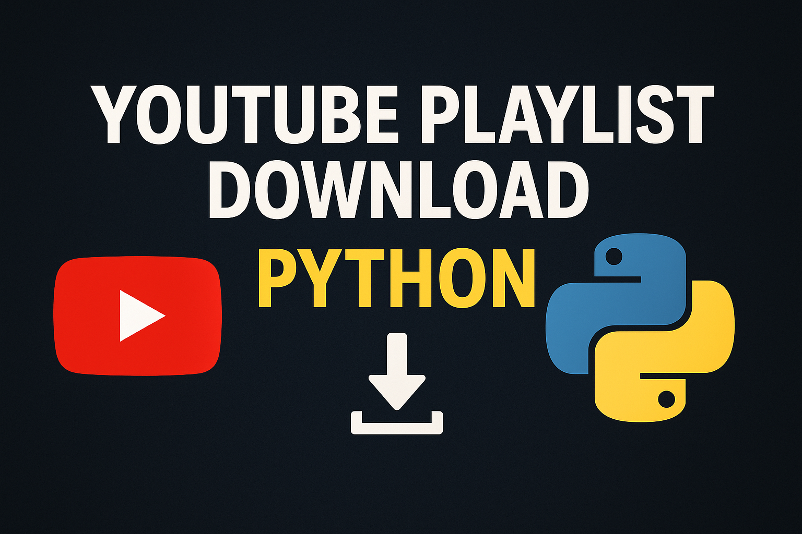

# 🎬 YouTube Playlist Downloader

A powerful command-line tool that downloads YouTube playlists in your preferred quality with smart resolution detection, robust validation, and comprehensive error handling.



## ✨ Features

- 📋 Download entire YouTube playlists with a single command
- 🎥 Auto-detection of available video resolutions
- 🔍 Smart quality selection with best video+audio combinations
- 🔄 Robust playlist validation before starting downloads
- ⏸️ Resume interrupted downloads automatically
- 📊 Real-time progress tracking and detailed status information
- 🛡️ Bypass common YouTube download restrictions
- 🚫 Comprehensive error handling with meaningful messages

## 🚀 Installation

<details>
<summary><b>Windows</b></summary>

### Windows Installation

1. **Install Python:**
   - Download and install [Python 3.8+](https://www.python.org/downloads/windows/)
   - Make sure to check "Add Python to PATH" during installation

2. **Install ffmpeg:**
   - Download ffmpeg from [here](https://www.gyan.dev/ffmpeg/builds/)
   - Extract the ZIP file
   - Add the bin folder to your system PATH

3. **Set up the environment:**
   ```cmd
   :: Create a virtual environment
   python -m venv youtube-dl-env
   
   :: Activate the virtual environment
   youtube-dl-env\Scripts\activate
   
   :: Install yt-dlp
   pip install yt-dlp
   ```

4. **Download the script:**
   ```cmd
   curl -o ytp-downloader.py https://raw.githubusercontent.com/shahedfardous/ytp-downloader/main/ytp-downloader.py
   ```
</details>

<details>
<summary><b>macOS</b></summary>

### macOS Installation

1. **Install Homebrew (if not already installed):**
   ```bash
   /bin/bash -c "$(curl -fsSL https://raw.githubusercontent.com/Homebrew/install/HEAD/install.sh)"
   ```

2. **Install Python and ffmpeg:**
   ```bash
   brew install python ffmpeg
   ```

3. **Set up the environment:**
   ```bash
   # Create a virtual environment
   python3 -m venv ~/youtube-dl-env
   
   # Activate the virtual environment
   source ~/youtube-dl-env/bin/activate
   
   # Install yt-dlp
   pip install yt-dlp
   ```

4. **Download the script:**
   ```bash
   curl -o ytp-downloader.py https://raw.githubusercontent.com/shahedfardous/ytp-downloader/main/ytp-downloader.py
   ```
</details>

<details>
<summary><b>Linux (Ubuntu/Debian)</b></summary>

### Ubuntu/Debian Installation

1. **Install required packages:**
   ```bash
   sudo apt update
   sudo apt install python3-venv ffmpeg
   ```

2. **Set up the environment:**
   ```bash
   # Create a virtual environment
   python3 -m venv ~/youtube-dl-env
   
   # Activate the virtual environment
   source ~/youtube-dl-env/bin/activate
   
   # Install yt-dlp
   pip install yt-dlp
   ```

3. **Download the script:**
   ```bash
   wget -O ytp-downloader.py https://raw.githubusercontent.com/shahedfardous/ytp-downloader/main/ytp-downloader.py
   chmod +x ytp-downloader.py
   ```
</details>

<details>
<summary><b>Kali Linux (WSL)</b></summary>

### Kali Linux (WSL) Installation

1. **Install required packages:**
   ```bash
   sudo apt update
   sudo apt install python3-venv ffmpeg
   ```

2. **Set up the environment:**
   ```bash
   # Create a virtual environment
   python3 -m venv ~/youtube-dl-env
   
   # Activate the virtual environment
   source ~/youtube-dl-env/bin/activate
   
   # Install yt-dlp
   pip install yt-dlp
   ```

3. **Download the script:**
   ```bash
   wget -O ytp-downloader.py https://raw.githubusercontent.com/shahedfardous/ytp-downloader/main/ytp-downloader.py
   chmod +x ytp-downloader.py
   ```
</details>

## 💻 Usage

<details>
<summary><b>Windows</b></summary>

### Windows Usage

1. Open Command Prompt or PowerShell
2. Navigate to the folder containing the script
3. Activate your virtual environment:
   ```cmd
   youtube-dl-env\Scripts\activate
   ```
4. Run the script:
   ```cmd
   python ytp-downloader.py
   ```
5. Follow the interactive prompts
</details>

<details>
<summary><b>macOS/Linux/WSL</b></summary>

### macOS/Linux/WSL Usage

1. Open Terminal
2. Navigate to the folder containing the script
3. Activate your virtual environment:
   ```bash
   source ~/youtube-dl-env/bin/activate
   ```
4. Run the script:
   ```bash
   ./ytp-downloader.py
   ```
   or
   ```bash
   python3 ytp-downloader.py
   ```
5. Follow the interactive prompts
</details>

## 📋 Interactive Prompts

```
🎬 YouTube Playlist Downloader
----------------------------
Enter playlist URL: https://www.youtube.com/playlist?list=PLDyQo7g0_nssewwfe3VHmyZZpVJyFn5ojlboVEhE
Validating playlist URL...
Output directory [downloads]: guitar-lessons
Checking available quality options...
Available quality options: 360p, 480p, 720p, 1080p, 1440p, 2160p
Maximum video quality [1080p]: 

Fetching playlist information...
✓ Found 24 videos in playlist

Downloading 24 videos to 'guitar-lessons' directory
Selected maximum quality: 1080p
Press Ctrl+C to stop the download process at any time

[youtube] Extracting URL: https://www.youtube.com/playlist?list=PLDyQo7g0_nssewwfe3VHmyZZpVJyFn5ojlboVEhE
[youtube] PLDyQo7g0_nssewwfe3VHmyZZpVJyFn5ojlboVEhE: Downloading webpage
[download] Downloading playlist: Guitar Lessons for Beginners
[youtube] Playlist Guitar Lessons for Beginners: Downloading 24 videos
[download] Downloading video 1 of 24
...

🏁 Download completed successfully!
Downloaded 24 file(s) to 'guitar-lessons' directory.
```

## ⚙️ Error Handling

The script has robust error handling for common issues:

- **Invalid Playlist URLs:** The script validates playlist URLs before attempting downloads
- **Non-existent Playlists:** Detects when YouTube reports that a playlist doesn't exist
- **Empty Playlists:** Checks if playlists contain any videos before proceeding
- **Connection Issues:** Gracefully handles network interruptions
- **File System Errors:** Verifies that files were actually downloaded
- **User Interruptions:** Cleanly handles Ctrl+C stopping of downloads

## 🔧 Advanced Configuration

You can modify these script parameters for advanced usage:

- **Format Selection**: The script uses `bestvideo[height<={quality}]+bestaudio/best[height<={quality}]/best` to get the best possible quality
- **Output Filename Pattern**: Change the `-o` parameter to customize filename formats
- **Additional Options**: Uncomment the `--verbose` line for detailed debugging information

## 🔄 How It Works

1. **Playlist Validation**: Before downloading, the script validates the playlist URL to ensure it exists
2. **Resolution Detection**: The script checks the first video in the playlist to determine available resolutions
3. **Smart Quality Selection**: Uses yt-dlp's advanced format selection to get the best video/audio combination
4. **Real-time Progress**: Displays download progress for each video in real-time
5. **Verification**: Verifies that files were actually downloaded before reporting success

## 🤝 Contributing

Contributions are welcome! Feel free to submit a Pull Request.

## 📜 License

This project is licensed under the MIT License - see the LICENSE file for details.

## 👤 Author

**Md Shahed Fardous**

- Website: [shahedfardous.com](https://www.shahedfardous.com)
- GitHub: [shahedfardous](https://github.com/shahedfardous)

## 🙏 Acknowledgments

- [yt-dlp](https://github.com/yt-dlp/yt-dlp) - An excellent fork of youtube-dl with additional features and fixes
- [ffmpeg](https://ffmpeg.org/) - The powerful multimedia framework used for processing audio and video
- Inspired by various YouTube downloader solutions in the open-source community

---

⭐ If you find this tool useful, consider giving it a star on GitHub!